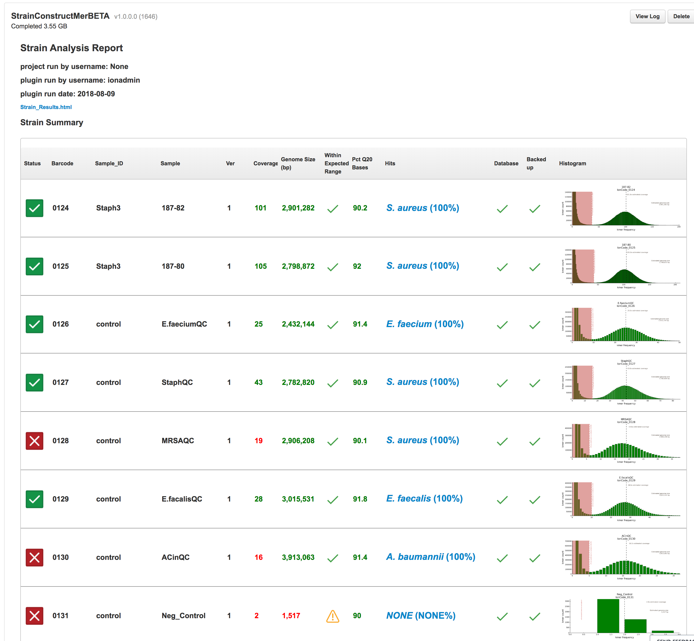

<hr>


# StrainTypeMer
__StrainTypeMer__ is a program created to compare genomes of two or more samples. The primary use case is for 
epidemiological analysis. The program analyzes NGS data created by Whole Genome Fragmentation protocol.
This version of __StrainTypeMer__ works as two Ion Torrent Plugins. 

# StrainConstructMer
__StrainCon
This plugin processes a sample and transform the data so that comparisons can be performed with the __StrainCompareMer__ plugin.

___
# Features
__StrainConstructMer__ and __StrainCompareMer__ together comprise a package called __StrainTypeMer__, which performs strain comparison using
kmers.  Strain Comparision is performed reference-free creating a universal strain comparison method that will work across many species and genera
of organisms.

### StrainTypeMer
* Calculates coverage
* Determines the genome size of the organism
    * Determines if genome size is expected value
* Identifies the bacteria based in [NCBI 16S rRNA RefSeq references](https://www.ncbi.nlm.nih.gov/bioproject/?term=PRJNA33175)
* Determines MLST type using [PUBMLST](https://pubmlst.org/])
* Identify antibiotic resistant genes present in [NCBI AMR references](https://www.ncbi.nlm.nih.gov/bioproject/?term=PRJNA313047)
* Includes multiple comparisons
    * Full Genome comparison
    * Filter Comparison to remove errors
    * Core genome comparison for *Staphylococcus aureus*, *Acinetobacter baumannii*, *Enterococcus facalis*, *E. faecium*
    * Non-core comparison for *Staphylococcus aureus*, *Acinetobacter baumannii*, *Enterococcus facalis*, *E. faecium*
    * Rescue comparison for contaminated samples

___

## Required Setup
### jellyfish [required] https://github.com/gmarcais/Jellyfish/

jellyfish is a kmer counter needed by __StrainConstructMer__

##### Install as follows:
```bash
mkdir /results/plugins/scratch/apps
cd /results/plugins/scratch/apps
wget https://github.com/gmarcais/Jellyfish/releases/download/v2.2.7/jellyfish-2.2.7.tar.gz
tar xvf jellyfish-2.2.7.tar.gz
cd jellyfish-2.2.7
./configure
make -j 4

# may not be required
sudo make install

# test command
$> /results/plugins/scratch/apps/jellyfish-2.2.7/bin/jellyfish
# should return
...Too few arguments
...Usage: jellyfish <cmd> [options] arg...
...Where <cmd> is one of: count, bc, info, stats, histo, dump, merge, query, cite, mem, jf.
...Options:
...  --version        Display version
...  --help           Display this message
```
____
## Installing Plugin

1. Click releases on the github page.
2. Download the `Source Code (zip)`
3. Un-compress
3. Change the name of the download file to `StrainConstructMerBeta`
4. Re-compress
4. Install the zip file through the Torrent Server Plugin interface

___
## Usage

__StrainConstructMer__ will process all the sample on a project.  No input or configuration is required.

Once the samples have been processed the report table will be created.

#### Report columns

| Column position | column Name | column information |
|-----------------|-------------|--------------------|
| 1               | Status      | <ul><li>Icon indicates if the sample __passed QC__ and is suitable for comparison</li><li>Clicking the icon brings up data files including antibiotic genes detected</li></ul> |
| 2               | Barcode     | Barcode ID of sample  |
| 3               | Sample_ID   | The Sample_ID of the sample |
| 4               | Sample      | The sample name of the sample|
| 5               | Ver         | The sample version.  The sample version is incremented automatically by __StrainConstructMer__. If the `bamfile_path` and `read count` are unique and `Sample_ID` and `Sample` are already in the database the `version` is incremented by one. Otherwise previous data is overwritten.|
| 6               | Coverage    | The coverage of the sample.  25X is the minimum coverage allowed. |
| 7               | Genome Size | The estimated genome size based on the number of distinct kmers observed. The genome size must be greater that 1,000,000bp.|
| 8               | With Expected Range | Is the estimated genome size is within 10% of the minimum and maximum genome size for the top classifier hit.|
| 9               | Pct Q20 bases       | The percentage of Q20 base observed in the reads|
| 10              | Hits                | <ul><li>The top classifier hit</li><li>Clicking link brings up page showing all classifier hits</li></ul>|
| 11              | Database            | Status of the database backup. Green check mark if sample successfully added to the database.|
| 12              | Backup              | Status of the sample backup. Hover over icon for more info|
| 13              | Histogram           | The histogram of kmer frequency and kmer count |


#### Screenshot of Report



___

## Limitations and notes

#### Sample database and backups
`StrainCompareMer` relies on samples to be run through `StrainConstructMer`. `StrainConstructMer` therefore writes information
to an SQLite database which by default is placed into `/results/plugins/scratch/`.  The database only holds sparse information
about the sample. If the plugin results for a sample are deleted then `StrainComparMer` may fail. This can be easily be rectify
by reruning `StrainConstructMer` on the project that contains the sample of interest. Alternatively, you can specify a
backup location. The backup location will hold the required data need to perform comparision and will not be affected if
a plugin is run multiple times or deleted.  Backup data will need to be deleted manually using the commandline interface.

Both the backup directory and SQLite database can be configured using the global configuration page on the plugin settings page.

By default the backup directory is not set. If you are interested in setting up a backup directory and do not need to have
multiple instruments accessing the same data `/results/plugins/scratch/` is a good option.

If you desire to have multiple instruments accessing to the same StrainConstructMer results, this can be achieved by mounting a
network drive and specifying the database and backup location point to this network drive.
___
#### Comparing Strains
* We have found that at least 25X coverage is need to preform a high quality comparison. Above this coverage it is
easier to remove errors from the data set.

* Determining if estimated genome size is accurate is based on the classifier results. The top hit from the classifier
  is compared to a list of known genome sized for the species. Currently the genome size list only contains *Acinetobacter*,
  *Staphylococcus*, and *Enterococcus*.
 
* Access to the raw data files, which include antibiotic resistant genes, can be accessed by clicking the status icon

* QC parameters are hard coded
    * \>25X coverage
    * Genome size \> 1,000,000bp
    * Genome size within 10% of min and max for species or genus (only used for *Acinetobacter*, *Staphylococcus*, and *Enterococcus*)
    
&copy; 2018, ARUP Laboratories


___
