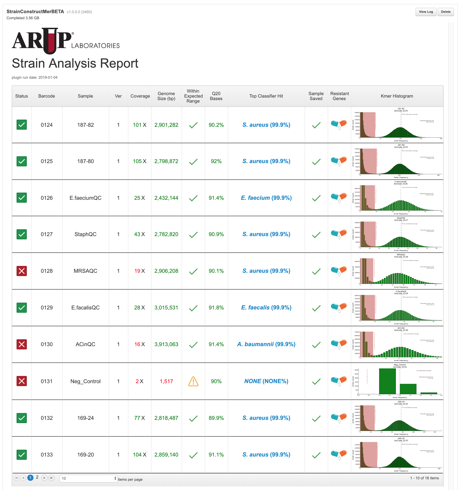

---

# ARUP StrainTypeMer
__ARUP StrainTypeMer__ is a rapid program that compares the nucleotide content of one or more samples/strains. 
The primary use case is epidemiological analysis.  This tool can replace Pulsed Field Gel Electrophoresis (PFGE). 
Results are presented and interpreted in a manner similar to PFGE. Samples/strains are grouped as _Clonal_, _Closely_, 
_Possibly_ and _Not_ Related.

The program analyzes NGS data created by a Whole Genome Fragmentation Protocol. This version of __ARUP StrainTypeMer__ 
works as two Ion Torrent Plugins __ARUP StrainConstructMer__ and __ARUP StrainCompareMer__. While most epidemiological 
NGS methods require reference alignment __ARUP StrainTypeMer__ is designed to run reference free. This creates a 
universal analysis method to compared strains unhindered by the amount of identity a sample has with the reference 
sequence or the availability of a suitable reference. Because __ARUP StrainTypeMer__ is reference-free it creates a 
universal strain comparison method that will work across many species and genera.  Analysis can be completed in under 
30 minutes for 5-20 samples.

# ARUP StrainConstructMer
__ARUP StrainConstructMer__ is the first plugin in the StrainTypeMer analysis. This plugin processes a sample and 
transform the data so that comparisons can be performed with the __ARUP StrainCompareMer__ plugin. 

## Features
* Calculates coverage
* Determines the genome size of the organism
    * Determines if genome size is expected value
* Identifies the bacteria based in [NCBI 16S rRNA RefSeq references](https://www.ncbi.nlm.nih.gov/bioproject/?term=PRJNA33175)
* Determines MLST type using [PUBMLST](https://pubmlst.org/])
* Identify antibiotic resistant genes present in [NCBI AMR references](https://www.ncbi.nlm.nih.gov/bioproject/?term=PRJNA313047)
* Performs Quality checks to determine is sample can be compared in __StrainCompareMer__

# Guide
__ARUP StrainConstructMer__ will process all the sample on a project.  No input or configuration is required. Once samples
are complete a summary report will be created. Samples processed by the plugin are placed into a database that 
__ARUP StrainCompareMer__ can access for comparisons. The database location is set on the global configuration page. 
It must be identical to the location set in __ARUP StrainCompareMer__ (default location `/results/plugins/scratch/`)
[see below for notes regarding the StrainConstructMer database.](#sample-database-and-backups)

### Summary Report
The summary report appears after the plugin has finished processing samples.  The report contains a table with each row
corresponding to a sample on the run.  

| Column Position | Column Name         | Column Information |
|-----------------|---------------------|--------------------|
| 1               | Status              | <ul><li>Icon indicates if the sample __passed QC__ and is suitable for comparison</li><li>Clicking the icon brings up data files including antibiotic genes detected</li></ul> |
| 2               | Barcode             | Barcode ID of sample  |
| 3               | Sample              | The sample name of the sample|
| 4               | Ver                 | The sample version.  The sample version is incremented automatically by __StrainConstructMer__. If the `bamfile_path` and `read count` are unique and `Sample_ID` and `Sample` are already in the database the `version` is incremented by one. Otherwise previous data is overwritten.|
| 5               | Coverage            | The coverage of the sample.  25X is the minimum coverage allowed. |
| 6               | Genome Size         | The estimated genome size based on the number of distinct kmers observed. The genome size must be greater that 1,000,000bp.|
| 7               | With Expected Range | Is the estimated genome size is within 10% of the minimum and maximum genome size for the top classifier hit.|
| 8               | Q20 Bases           | The percentage of Q20 base observed in the reads|
| 9               | Top Classifier Hit  | <ul><li>The top classifier hit</li><li>Clicking link brings up page showing all classifier hits</li></ul>|
| 10              | Sample Saved        | Status of the database backup. Green check mark if sample successfully added to the database.|
| 11              | Resistant Genes     | Links to table displaying the antibiotic genes found in the sample |
| 12              | Kmer Histogram      | The histogram of kmer frequency and kmer count |

#### Screen Shot of Report

<kbd>

</kbd>

---
### 16S rRNA Classifier Table

Clicking the top hit for a sample in the summary table opens a new tab showing the complete list of classifier hits 
from NCBI's reference set for the selected sample.

| Column position | column Name | column information |
|-----------------|-------------|--------------------|
| 1               | Kmer identity                   | The % kmer identity the sample shares with reference |
| 2               | Species                         | Species of reference  |
| 3               | Accession                       | Genbank accession of reference |
| 4               | Predicted Size for Strain       | Predicted Genomes size of the sample |
| 5               | Median Genome Size Species      | The Median genome size of the reference species based on completed NCBI genomes |
| 6               | Min Genome Size Species         | The Min genome size of the reference species based on completed NCBI genomes |
| 7               | Max Genome Size Species         | The Max genome size of the reference species based on completed NCBI genomes |
| 8               | Median Genome Size Genus        | The Median genome size of the reference genus based on completed NCBI genomes |
| 9               | Min Genome Size Genus           | The Min genome size of the reference genus based on completed NCBI genomes |
| 10              | Max Genome Size Genus           | The Max genome size of the reference genus based on completed NCBI genomes |

### Screen Shot of Classifier Hits Table

<kbd>

</kbd>

___

### Antibiotic Resistance Genes

Clicking the drug icon for a sample opens a new tab showing the antibiotic resistance genes found in the strain based on
NCBI's AMR reference set [NCBI AMR references](https://www.ncbi.nlm.nih.gov/bioproject/?term=PRJNA313047)

| Column position | column Name | column information |
|-----------------|-------------|--------------------|
| 1               | Allele                       | The allele name of the AMR reference |
| 2               | Genbank Accession            | Genbank accession of reference  |
| 3               | Gene                         | The gene name of the AMR reference |
| 4               | Description                  | The description of the AMR reference |
| 5               | Percent Kmer Identity        | Kmer identity the sample shares with the AMR reference |
| 6               | Coverage Change from Genome  | The coverage change observed for the gene. This is an indication of the number of copies of the gene |
| 7               | Originating Species          | The species of origin for the AMR reference |

### Screen Shot of Antibiotic Resistance Genes

<kbd>

</kbd>

---

# ARUP StrainCompareMer
__ARUP StrainCompareMer__ is the second plugin in the __ARUP StrainTypeMer__ analysis. 

## Features
* Includes multiple comparisons
    * Full Genome comparison
        * Similarity matrix showing percent kmer identity shared between each to the samples.
    * Full Genome comparison with select references
        * Same as above but includes selected NCBI references.  References selected based on sample ID.  
    * Core genome comparison for organism in table below
        * Compares the core kmer subset between samples (most conserved kmers). Comparision is made if all samples are 
        the same organism and the core reference set is available.      
    * Non-core comparison for organism in table below
        * Compares the non-core kmer subset between sample (accessory genome). Comparision is made if all samples are 
            the same organism and the core reference set is available.
    * Rescue 
        * Modified Full genome comparision that only compares kmers in the smallest of the to samples processed.
        * This is helpful:
            * To compare a sample with low coverage to a sample with higher coverage
            * To observe changes caused a large acquisition of DNA
    * Relationships
        * Interpretation based on cutoffs:
            * Indistinguishable \>99.9% Kmer Identity 
            * Closely Related 98.7-99.9% Kmer Identity 
            * Possibly Related 95.0-98.7% Kmer Identity 
            * Unrelated \<95.0% Kmer Identity 
    * Comparision Table
        * Table shows details about each comparison
    * Strain Summary
        * Similar to the Summary page form __ARUP StrainConstructMer__.  MLST profiles included in output.

# Guide
The plugin requires a CSV file as input. The CSV file indicates the strains to be processed. The strains must exist in 
the database and the plugin must be able to locate the files associated with the strain.  The database location is set 
on the global configuration page. It must be identical to the location set for __ARUP StrainConstructMer__ (default 
location `/results/plugins/scratch/`). 

#### Core Genomes

Core genomes were constructed using completed RefSeq genomes from NCBI. A maximum of 25 genomes were used if available.
By default we use a 80% threshold that requires a kmer needs be observed in 80% of genomes to be considered a 'core' kmer.
This is modified for some species in order to target a core kmer size near 40%-70% of the overall genome size.

| Organism                     | Average Genome Size   | Genomes Analyzed | Core Kmer Size (Pct of Genome Size) | Percent Cutoff   |
|:-----------------------------|:---------------------:|:----------------:|:-----------------------------------:|:----------------:|
|_Acinetobacter baumannii_     | 3,945,908             | 25               | 2,040,177 (52%)                     | 80               |
|_Enterococcus faecalis_       | 2,909,703             | 20               | 1,812,881 (62%)                     | 80               |
|_Enterococcus faecium_        | 2,827,968             | 25               | 1,833,417 (65%)                     | 95               |
|_Escherichia coli_            | 4,969,315             | 25               | 1,914,103 (39%)                     | 80               |
|_Klebsiella pneumoniae_       | 5,315,713             | 25               | 3,825,265 (71%)                     | 90               |
|_Pseudomonas aeruginosa_      | 6,581,730             | 25               | 4,416,660 (67%)                     | 80               |
|_Serratia marcescens_         | 5,234,322             | 25               | 1,910,225 (36%)                     | 60               |
|_Staphylococcus aureus_       | 2,852,092             | 25               | 1,726,487 (61%)                     | 80               |
|_Staphylococcus epidermidis_  | 2,544,188             | 15               | 1,665,072 (65%)                     | 80               |
|_Stenotrophomonas maltophilia_| 4,726,726             | 20               | 1,240,438 (26%)                     | 50               |

<em> Note: We constructed the core kmer sets using utility script `create_core_reference_set.py`. However users may
construct core reference set as they see fit.  The file must be placed into 
`/results/plugins/StrainCompareMer/strain_comparison/resources/core_reference_sets` and must be prefixed with a 
organism name. </em>

### Screen Shot of Full Genome Matrix

<kbd>

</kbd>

### Screen Shot of Relationship Table

<kbd>

</kbd>

### Screen Shot of Comparison Table

<kbd>

</kbd>

### Screen Shot of Reference Matrix

<kbd>

</kbd>

### Screen Shot of Core Matrix

<kbd>

</kbd>

### Screen Shot of Non-Core Matrix

<kbd>

</kbd>

### Screen Shot of Strain Summary

<kbd>

</kbd>

___

## Installing Plugins

1. Click releases on the github page.
2. Download the `{name}.zip`
3. Install the zip file through the Torrent Server Plugin interface

___

# Limitations and Notes

## Sample Database and Backups
`StrainCompareMer` relies on samples to be run through `StrainConstructMer`. `StrainConstructMer` therefore writes information
to an SQLite database which by default is placed into `/results/plugins/scratch/`.  The database only holds sparse information
about the sample. If the plugin results for a sample are deleted then `StrainComparMer` may fail. This can be easily be rectify
by rerunning `StrainConstructMer` on the project that contains the sample of interest. Alternatively, you can specify a
backup location. The backup location will hold the required data need to perform comparision and will not be affected if
a plugin is run multiple times or deleted.  Backup data will need to be deleted manually using the commandline interface.

Both the backup directory and SQLite database can be configured using the global configuration page on the plugin settings page.

By default the backup directory is not set. If you are interested in setting up a backup directory and do not need to have
multiple instruments accessing the same data `/results/plugins/scratch/` is a good option.

If you desire to have multiple instruments accessing to the same `StrainConstructMer` results, this can be achieved by mounting a
network drive and specifying the database and backup location point to this network drive.
___

## Comparing Strains
* We have found that at least 25X coverage is need to preform a high quality comparison. Above this coverage it is
easier to remove errors from the data set.

* Determining if estimated genome size is accurate is based on the classifier results. The top hit from the classifier
  is compared to a list of known genome sized for the species. The Genome sizes are based on completed NCBI genomes.
 
* Access to the raw data files can be achieved by clicking the status icon

* QC parameters are hard coded
    * \>25X coverage
    * Genome size \> 1,000,000bp
    * Genome size within 10% of min and max for species. If the species is not in NCBI genomes size of genus will be used.
    if the genus is not present the Genome size is ignored as a QC parameter. 
    
---

_When using this resource in publications, please cite the following:
Keith Simmon PhD, ARUP Laboratories at the University of Utah, ARUP StrainTypeMer software_

&copy; 2019, ARUP Laboratories

___
